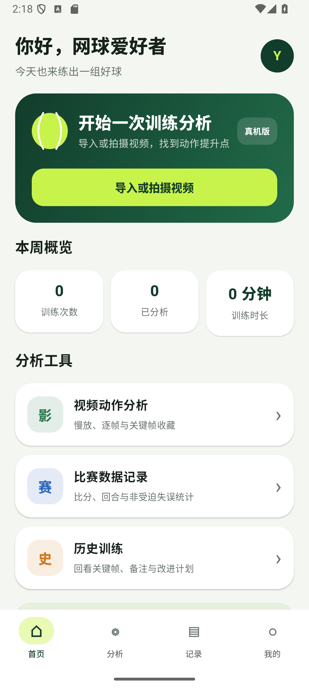
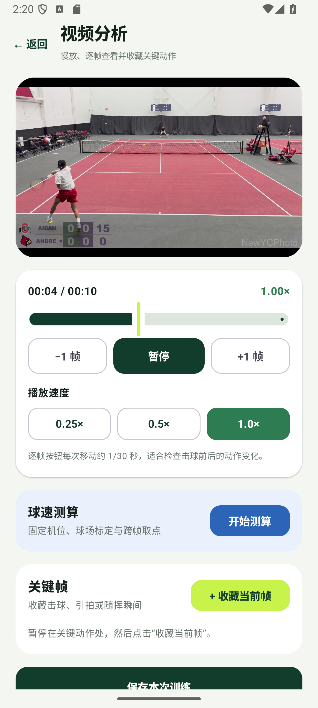
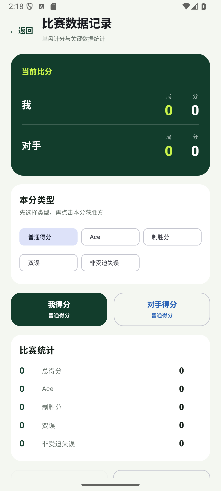
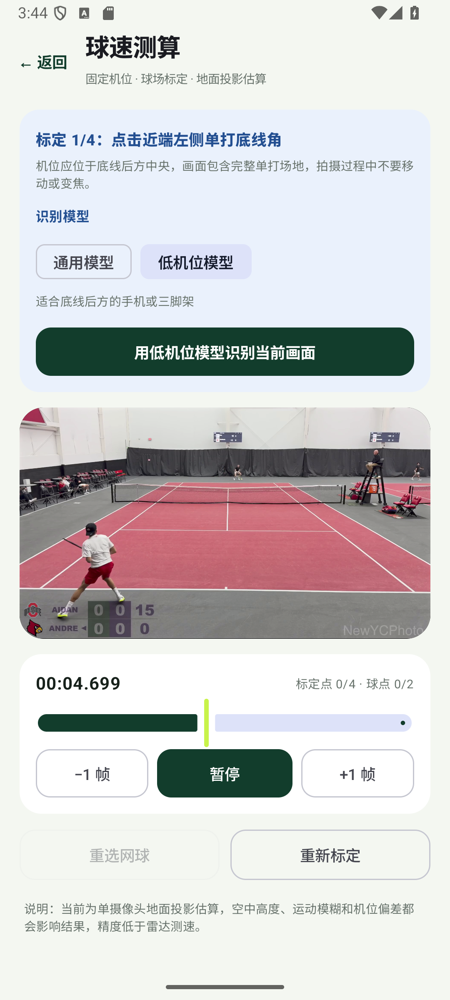
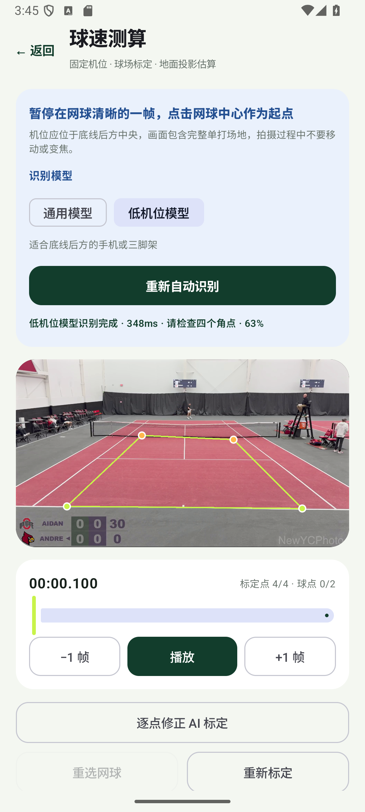

# Tennis Analyzer Android

面向网球爱好者的 Android 视频分析应用。当前版本支持训练视频回看、逐帧分析、比赛记录、AI 球场标定和固定机位球速估算。

<p align="center">
  
</p>

> 当前为测试版本。球场识别已经支持通用机位和底线后方低机位；网球轨迹仍需人工跨帧取点。

## 功能概览

| 视频训练分析 | 比赛数据记录 |
|---|---|
|  |  |
| 慢放、逐帧查看、关键帧收藏和球速入口 | 比分、Ace、制胜分、双误和非受迫失误统计 |

- 导入或拍摄训练视频
- 视频播放、暂停、慢放和逐帧查看
- 收藏关键帧并保存训练备注
- 记录比赛比分与关键技术统计
- 通用球场关键点模型
- 底线后方手机/三脚架低机位模型
- 自动识别四个单打场地角点并支持人工修正
- 根据跨帧网球位置进行球速估算

## 使用说明

### 1. 拍摄视频

为了提高球场识别和球速估算的稳定性，建议：

- 手机横屏拍摄，画面比例使用 16:9。
- 手机放在底线后方中央，尽量与球场中线对齐。
- 使用三脚架或固定支架，拍摄过程中不要移动手机或变焦。
- 画面应包含完整的单打场地四角，球场线尽量清晰、无遮挡。
- 避免光线不足、强烈逆光和严重运动模糊。
- 第一次测试可以先拍摄 10～30 秒的短视频。

### 2. 导入视频并分析动作

1. 打开 Tennis Analyzer。
2. 在首页点击“导入或拍摄视频”，也可以从“视频动作分析”进入。
3. 从相册选择一段网球视频。
4. 使用进度条、播放/暂停和“−1 帧 / +1 帧”检查动作。
5. 在击球、引拍或随挥等位置点击“收藏当前帧”。
6. 点击“保存本次训练”，填写训练标题、动作类型和备注。

<p align="center">
  
</p>

保存后的训练可以在底部“记录”页面查看。

### 3. 球速测算

在视频分析页面点击“开始测算”。测速分为“球场标定”和“网球取点”两个阶段。

#### 3.1 选择识别模型

| 拍摄方式 | 推荐模型 |
|---|---|
| 底线后方手机或三脚架 | **低机位模型** |
| 电视转播视频 | **通用模型** |
| 看台或较高固定机位 | 先尝试通用模型 |
| 角点明显偏移 | 切换模型重新识别，或人工修正 |

低机位模型是测速页面的默认选择。切换模型会清除当前标定和测速结果。

<p align="center">
  
</p>

#### 3.2 自动标定球场

1. 暂停到球场线清晰、无遮挡的一帧。
2. 点击“用低机位模型识别当前画面”或“用通用模型识别当前画面”。
3. 检查视频上的四个角点和绿色场地边框。
4. 如果点位有偏差，点击“逐点修正 AI 标定”。
5. 按页面提示依次点击：
   - 近端左侧单打底线角
   - 近端右侧单打底线角
   - 远端右侧单打底线角
   - 远端左侧单打底线角

自动识别失败时，也可以直接按上述顺序手动点击四个角点。

<p align="center">
  
</p>

#### 3.3 选择网球位置

1. 暂停在网球清晰的一帧，点击网球中心作为起点。
2. 使用“+1 帧”、进度条或播放按钮向前移动若干帧。
3. 再次点击网球中心作为终点。
4. 应用会显示估算球速、移动距离、时间差和可信度。
5. 确认后点击“使用这个结果”，球速会带回本次训练。

选点不准确时点击“重选网球”；球场角点不准确时点击“重新标定”。

### 4. 比赛数据记录

1. 从首页进入“比赛数据记录”。
2. 先选择普通得分、Ace、制胜分、双误或非受迫失误。
3. 点击“我得分”或“对手得分”。
4. 应用自动更新局分、当前比分和技术统计。
5. 完成后点击“保存比赛记录”。

<p align="center">
  
</p>

## 当前限制

- 球场角点支持 AI 自动识别，但网球轨迹还不能自动跟踪。
- 球速是单摄像头地面投影估算，并非三维测速。
- 网球飞行高度、相机偏斜、运动模糊和选点误差都会影响结果。
- 当前结果适合训练分析和版本测试，精度低于专业测速雷达。
- 低机位模型仍需更多真实手机视频验证，尤其是夜场、逆光和不同颜色球场。

## 常见问题

### 自动识别失败怎么办？

暂停到球场线更清晰的一帧，确认视频为横屏 16:9，并检查画面是否包含完整场地。仍然失败时可以切换模型或手动标定。

### 识别成功但角点不准怎么办？

点击“逐点修正 AI 标定”，按提示重新点击四个单打底线角。不要在角点错误时继续测速。

### 球速明显过高或过低怎么办？

检查球场角点、两个网球点是否准确，以及两个画面是否相隔太近。建议增加取点时间间隔后重新测量。

### 是否只能在 Vivo 手机上使用？

不是。它是通用 Android 应用，目前已在 Android 虚拟机和 Redmi K40 上通过测试，不同品牌和型号仍需逐步验证性能与相册兼容性。

### 拔掉数据线后还能使用吗？

可以。应用安装完成后可独立运行。数据线只在安装新版本、读取测试日志或调试时需要。

## 开发环境

- Android Studio
- Android Studio 自带 JDK
- Android SDK 36
- 最低 Android 版本：Android 7.0（API 24）

首次打开项目后，在 Android Studio 中完成 Gradle 同步即可运行。`local.properties`、构建缓存和 APK 不进入版本库。

## AI 模型

应用在 `app/src/main/assets` 中保留两套 FP32 LiteRT/TFLite 模型：

- `court_keypoints_fp32.tflite`：通用或较高机位
- `court_keypoints_low_camera_v1_fp32.tflite`：底线后方低机位

低机位模型目前属于候选版本，已经通过 Android 虚拟机和 Redmi K40 设备测试，仍需使用更多独立真实球场视频验证。

## 构建与测试

```powershell
.\gradlew.bat testDebugUnitTest assembleDebug assembleDebugAndroidTest
```

连接 Android 设备后可运行：

```powershell
.\gradlew.bat connectedDebugAndroidTest
```

设备测试会验证两份模型的文件完整性、张量规格、低机位标注帧精度，以及未参与训练视频的多帧识别。
